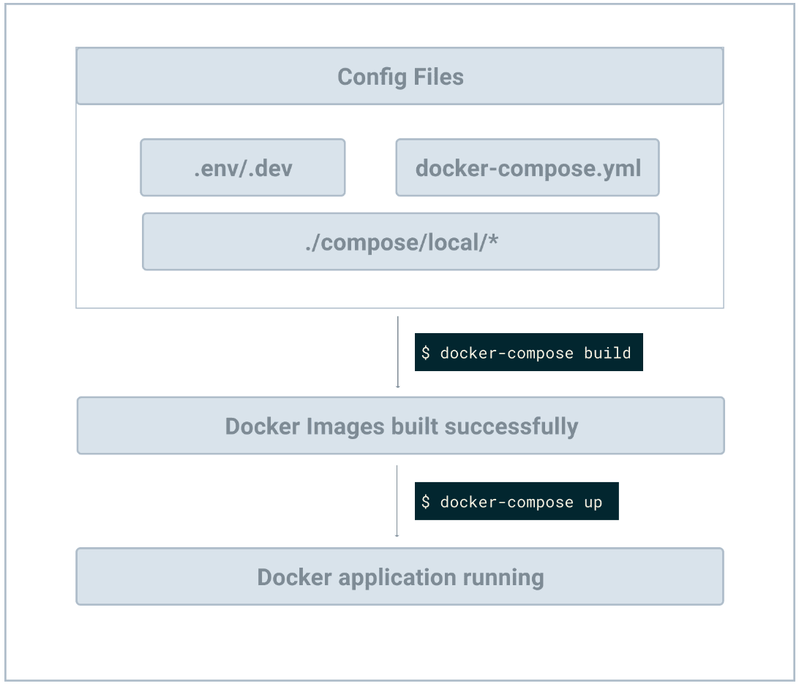

# crawl-bot

## Setup

```bash
$ python3 -m venv venv
$ . venv/bin/activate
$ pip install --upgrade pip
$ pip install -r requirements.txt
```

## Running Redis locally

In the new terminal tab, run the Redis server on your local machine (assuming Linux or macOS) using the following commands:

```bash
$ wget http://download.redis.io/redis-stable.tar.gz
$ tar xvzf redis-stable.tar.gz
$ rm redis-stable.tar.gz
$ cd redis-stable
$ make
```

The compilation is done now. Some binaries are available in the src directory inside redis-stable/ like redis-server (which is the Redis server that you will need to run) and redis-cli (which is the command-line client that you might need to talk to Redis). To run the server globally (from anywhere on your machine) instead of moving every time to the src directory, you can use the following command:

```bash
$ sudo make install
```

The binaries of redis-server are now available in your /usr/local/bin directory. You can run the server using the following command:

```bash
$ redis-server
```

The server is now running on port 6379 (the default port). Leave it running on a separate terminal. We would need two other new terminal tabs to be able to run the web server and the Celery worker later. But before running the web server, let's integrate Flask with Celery and make our web server ready to run.

## Running the Celery worker

In the new terminal tab, run the following command:

```bash
(venv) $ celery -A app.celery worker --loglevel=info
```

where celery is the version of Celery you're using in this tutorial (4.4.1), with the -A option to specify the celery instance to use (in our case, it's celery in the app.py file, so it's app.celery), and worker is the subcommand to run the worker, and --loglevel=info to set the verbosity log level to INFO.

You should see something like

```bash
celery@myhost.local v5.3.1 (emerald-rush)

macOS-13.4.1-arm64-arm-64bit 2023-08-08 11:42:27

[config]
.> app:         app:0x11ce28430
.> transport:   redis://localhost:6379//
.> results:     rpc://
.> concurrency: 10 (prefork)
.> task events: OFF (enable -E to monitor tasks in this worker)

[queues]
.> celery           exchange=celery(direct) key=celery


[tasks]
  . app.crawl

[2023-08-08 11:42:28,238: WARNING/MainProcess] /opt/homebrew/lib/python3.10/site-packages/celery/worker/consumer/consumer.py:498: CPendingDeprecationWarning: The broker_connection_retry configuration setting will no longer determine
whether broker connection retries are made during startup in Celery 6.0 and above.
If you wish to retain the existing behavior for retrying connections on startup,
you should set broker_connection_retry_on_startup to True.
  warnings.warn(

[2023-08-08 11:42:28,244: INFO/MainProcess] Connected to redis://localhost:6379//
[2023-08-08 11:42:28,244: WARNING/MainProcess] /opt/homebrew/lib/python3.10/site-packages/celery/worker/consumer/consumer.py:498: CPendingDeprecationWarning: The broker_connection_retry configuration setting will no longer determine
whether broker connection retries are made during startup in Celery 6.0 and above.
If you wish to retain the existing behavior for retrying connections on startup,
you should set broker_connection_retry_on_startup to True.
  warnings.warn(

[2023-08-08 11:42:29,438: INFO/MainProcess] mingle: searching for neighbors
[2023-08-08 11:42:30,449: INFO/MainProcess] mingle: all alone
[2023-08-08 11:42:30,464: INFO/MainProcess] celery@myhost.local ready.
```

## Running the Flask web server

In a new terminal run

```bash
$ python3.10 app.py
```

The server should be up and running

```bash
 ✘ mwm-etiennebondot@myhost  ~/Workspace/crawl-bot   main ±  python3.10 app.py
 * Serving Flask app 'app'
 * Debug mode: on
WARNING: This is a development server. Do not use it in a production deployment. Use a production WSGI server instead.
 * Running on http://127.0.0.1:8000
Press CTRL+C to quit
 * Restarting with stat
 * Debugger is active!
 * Debugger PIN: 701-049-463
127.0.0.1 - - [08/Aug/2023 11:44:52] "GET / HTTP/1.1" 200 -
127.0.0.1 - - [08/Aug/2023 11:44:52] "GET /static/css/styles.css HTTP/1.1" 304 -
127.0.0.1 - - [08/Aug/2023 11:44:56] "GET /static/css/styles.css HTTP/1.1" 304 -
127.0.0.1 - - [08/Aug/2023 11:44:59] "POST /start_crawling HTTP/1.1" 200 -
127.0.0.1 - - [08/Aug/2023 11:44:59] "GET /check_progress/b1280952-c534-4d66-8f61-393b81f8f2f3 HTTP/1.1" 200 -
127.0.0.1 - - [08/Aug/2023 11:45:00] "GET /check_progress/b1280952-c534-4d66-8f61-393b81f8f2f3 HTTP/1.1" 200 -
```

## Docker



```bash
$ docker-compose build
$ docker-compose up -d
```

Then go to http://localhost:8000.
